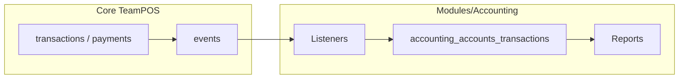

# Accounting module enhancement plan (TeamPOS, multi-branch)

## Constraints (agreed)

- **All implementation stays in** `[Modules/Accounting/](Modules/Accounting/)` (controllers, entities, migrations, views, listeners, `DataController`, routes, lang).
- **Do not** add Accounting-specific logic inside core `[app/Http/Controllers](app/Http/Controllers)` (e.g. `SellPosController`). The module already integrates via **Laravel events** registered in `[Modules/Accounting/Providers/AccountingServiceProvider.php](Modules/Accounting/Providers/AccountingServiceProvider.php)` (`SellCreatedOrModified`, `TransactionPayment*`, `PurchaseCreatedOrModified`, `ExpenseCreatedOrModified`).
- **Configuration** continues to use existing patterns: JSON `[business.accounting_settings](Modules/Accounting/Database/Migrations/2022_12_19_124743_add_accounting_settings_column_to_business_table.php)` and per-location `[BusinessLocation.accounting_default_map](Modules/Accounting/Resources/views/settings/index.blade.php)` (already multi-branch aware).
- **New relational data** = **new module migrations** against module-owned tables (`accounting_*`). Avoid altering core `business` / `transactions` unless you add a **separate, optional** migration shipped with the module that you document for installs (the module already added `business.accounting_settings` historically).

## Alignment with `teampos-module` skill (review)

| Skill rule                                                                         | Plan status               | Action                                                                                                                                                                                                                                       |
| ---------------------------------------------------------------------------------- | ------------------------- | -------------------------------------------------------------------------------------------------------------------------------------------------------------------------------------------------------------------------------------------- |
| All code under `Modules/Accounting/`                                               | **Aligned**               | Keep controllers, services, migrations, views, listeners, routes in module only.                                                                                                                                                             |
| No patches to `SellPosController` / core controllers                               | **Aligned**               | Integration stays on **events** in `AccountingServiceProvider` (existing pattern).                                                                                                                                                           |
| `DataController` for `user_permissions` / `modifyAdminMenu` / `superadmin_package` | **Aligned**               | New permissions go in `[DataController](Modules/Accounting/Http/Controllers/DataController.php)`; no new `getModuleData` hooks required for POS.                                                                                             |
| Guard `isModuleInstalled` + subscription                                           | **Partial — add**         | Where new **Artisan commands** or **queued jobs** are added, call `ModuleUtil::isModuleInstalled('Accounting')` before work. Listeners run only if module is loaded—document **reset/uninstall** so events do not leave orphan expectations. |
| Hooks must not break core DB transactions                                          | **Critical for Phase A4** | Period lock or GL write failures in **listeners** must **not throw**: log + skip AAT creation. Same for any new observer on `Transaction`—never rethrow into core sale flow.                                                                 |
| Permissions                                                                        | **Aligned**               | Register new keys (`accounting.reconcile`, etc.) in `user_permissions()`; gate controllers and blades.                                                                                                                                       |
| Routes: static before catch-all                                                    | **Add to Phase B**        | Register bank rec paths as **literal segments** (e.g. `reconciliation`, `bank-accounts/...`) **before** any `/{id}`-style routes in `[web.php](Modules/Accounting/Routes/web.php)`.                                                          |
| Inline JS / jQuery load order                                                      | **Add if needed**         | If bank rec or new reports inject scripts in `@section('content')`, **defer** until `window.jQuery` exists (poll or `$(function(){})` after layout scripts)—same pattern as CampaignSms contact tab.                                         |
| Verification: `rg Modules\\Accounting app/`                                        | **Aligned**               | Stays empty except optional `Kernel` schedule line.                                                                                                                                                                                          |
| `settings` / JSON on `business`                                                    | **Aligned**               | Period lock uses **existing** `accounting_settings` JSON column—no new core columns required for lock fields.                                                                                                                                |
| Install / reset                                                                    | **Add**                   | Extend `[SettingsController::resetData](Modules/Accounting/Http/Controllers/SettingsController.php)` to truncate **new** module tables (bank rec, audit logs) when resetting accounting data.                                                |

**Conclusion:** The build plan matches the **teampos-module** skill. **Must add explicitly:** (1) **non-throwing listener behavior** when period lock or GL errors occur, (2) **route ordering** for bank rec, (3) **resetData** coverage for new tables, (4) **deferred JS** if inline scripts are used, (5) **module-installed guards** on any new scheduled/command entry points.

## Current baseline (from code review)

- Reports hub: trial balance, balance sheet, ledger link, AR/AP ageing; **no P&L or cash flow** in `[Modules/Accounting/Resources/views/report/index.blade.php](Modules/Accounting/Resources/views/report/index.blade.php)`.
- `[ReportController](Modules/Accounting/Http/Controllers/ReportController.php)` groups trial balance by `**accounting_accounts.name`** only—risk of duplicate-name misstatement; accounts already have `**gl_code`** in `[create_accounting_accounts_table](Modules/Accounting/Database/Migrations/2022_11_01_104108_create_accounting_accounts_table.php)`.
- `[ReconcileController](Modules/Accounting/Http/Controllers/ReconcileController.php)` is a **stub**; **no routes** in `[Modules/Accounting/Routes/web.php](Modules/Accounting/Routes/web.php)`.
- GL lines: `[accounting_accounts_transactions](Modules/Accounting/Database/Migrations/2022_11_10_135427_create_accounts_transactions_table.php)` has no `**location_id`**; listeners already resolve `[transaction->location_id](Modules/Accounting/Listeners/MapSellTransaction.php)` for mapping defaults.

---

## Phase A — P0: Financial statements + integrity + period lock

### A1. Profit and Loss (Income Statement)

- Add `ReportController@profitAndLoss` (or dedicated service class in `Modules/Accounting/Services/` to keep controller thin).
- **Logic**: For `operation_date` in range, aggregate `accounting_accounts_transactions` joined to `accounting_accounts` where `account_primary_type` in `income`, `expense` (reuse `[AccountingUtil::balanceFormula](Modules/Accounting/Utils/AccountingUtil.php)` for signed amounts or explicit debit/credit rules consistent with existing TB/BS).
- **Output**: Sectioned P&L (revenue, COGS if you later split accounts, expenses, net income). **Optional v1**: single period columns; **v2**: month columns + YTD + prior-year compare (same dataset, wider pivot).
- **UI**: New card + route in `[report/index.blade.php](Modules/Accounting/Resources/views/report/index.blade.php)`; new blade under `Resources/views/report/`.
- **Permissions**: Reuse `accounting.view_reports` or add `accounting.view_profit_loss` in `[DataController::user_permissions](Modules/Accounting/Http/Controllers/DataController.php)` if you want finer RBAC.

### A2. Cash flow statement (pragmatic v1)

- **Direct method (recommended first)**: For accounts flagged as **cash/bank** (use existing detail/sub-type or add a boolean `is_cash_account` on `accounting_accounts` via module migration), sum net cash movement in period from `accounting_accounts_transactions`. Complement with **non-cash** sections only if data exists.
- **Indirect method** (later): Requires reliable opening/closing balance sheet snapshots and P&L net income—more work; document as Phase B if you need lender-grade indirect statements.
- Add report + route + report hub card.

### A3. Fix TB / BS grouping (account code + id)

- Update queries in `[ReportController](Modules/Accounting/Http/Controllers/ReportController.php)` (`trialBalance`, `balanceSheet`, and any duplicate query in `[AccountingController@dashboard](Modules/Accounting/Http/Controllers/AccountingController.php)`) to `**groupBy` `accounting_accounts.id`** (and select `gl_code`, `name`). Never aggregate by name alone.
- **Display**: Show `gl_code` + name in PDF/table views.

### A4. Period close / lock

- Store in `**business.accounting_settings` JSON** (no core code): e.g. `accounting_lock_date` (last closed period end) or `posting_not_before_date`.
- Implement `[AccountingUtil](Modules/Accounting/Utils/AccountingUtil.php)` helpers: `isDateLocked($operationDate)`, `assertNotLocked(...)`.
- **Enforce** in:
  - `[JournalEntryController](Modules/Accounting/Http/Controllers/JournalEntryController.php)` (store/update/delete),
  - `[TransferController](Modules/Accounting/Http/Controllers/TransferController.php)`,
  - `[TransactionController::saveMap](Modules/Accounting/Http/Controllers/TransactionController.php)`,
  - and **listeners** (`[MapSellTransaction](Modules/Accounting/Listeners/MapSellTransaction.php)`, etc.) before creating/updating `AccountingAccountsTransaction` lines (return early + log if locked).
- **Settings UI**: Extend `[settings/index.blade.php](Modules/Accounting/Resources/views/settings/index.blade.php)` + `[SettingsController.saveSettings](Modules/Accounting/Http/Controllers/SettingsController.php)` to persist lock fields (admin-only).

---

## Phase B — P0: Bank reconciliation (finish the stub)

### B1. Data model (module-only tables)

- e.g. `accounting_bank_accounts` (links `business_id`, `accounting_account_id` for the GL cash/bank account, label, `is_active`).
- e.g. `accounting_bank_statement_lines` (`bank_account_id`, `statement_date`, `amount`, `description`, `import_batch_id` nullable, `reconciled_at` nullable).
- e.g. `accounting_bank_reconciliation_matches` (statement_line_id ↔ `accounting_accounts_transactions.id` or payment id) — design for **many-to-one** or **one-to-one** match; keep amounts balanced.

### B2. Implement `[ReconcileController](Modules/Accounting/Http/Controllers/ReconcileController.php)`

- Replace placeholder views with real blades under `Resources/views/reconcile/` (or `banking/`).
- Wire **routes** in `[web.php](Modules/Accounting/Routes/web.php)` (resource or explicit: index, import, match, complete).
- Add permissions: `accounting.reconcile`, `accounting.import_bank_statement` in `DataController`.

### B3. UX

- Statement list, unreconciled vs cleared, running balance, optional CSV import.

---

## Phase C — P1: Audit trail + drill-down

### C1. Immutable audit log

- New table `accounting_audit_logs` (module migration): `business_id`, `user_id`, `action`, `auditable_type`, `auditable_id`, `before`, `after` (JSON), `ip` optional, `created_at`.
- **Observer** or explicit calls in journal/transfer/COA/map save/delete methods.
- **UI**: Read-only report under Accounting (filter by date/user/action).

### C2. Drill-down

- From TB/BS/P&L rows, link to **ledger** or filtered transaction list (existing `[CoaController@ledger](Modules/Accounting/Routes/web.php)` route `accounting.ledger`) with query params for date range + account id.

---

## Phase D — Multi-branch (location dimension on GL)

### D1. Schema

- Add nullable `location_id` to `accounting_accounts_transactions` (module migration, FK to `business_locations` optional).

### D2. Population

- When creating lines from **listeners**, set `location_id` from `$event->transaction->location_id` (or equivalent on expense/purchase).
- **Manual journals** / transfers: optional location dropdown (default `null` = consolidated).

### D3. Reporting

- Add **location filter** (dropdown using `BusinessLocation::forDropdown`) to P&L, cash flow, TB, BS; **“All locations”** = no filter.

---

## Phase E — P2 (optional, market-dependent)

- **Tax codes** on journal lines and mapped transactions; VAT/sales tax summary report.
- **Budget vs actual** on P&L using `[AccountingBudget](Modules/Accounting/Entities/AccountingBudget.php)`.
- **Fixed assets** register + depreciation journals (new subledger or tagged accounts).

---

## Explicit non-goals (this phase)

- **No** multi-entity consolidation across businesses (single legal entity per `business_id` remains).
- **No** full open-item AR/AP subledger matching to GL (large project); operational ageing reports remain, with a **future** milestone to reconcile GL control accounts to subledgers.
- **No** core `SellPosController` patches; use **events** only.

---

## Verification

- **Module-only grep**: `rg "Modules\\\\Accounting" app/` should stay **empty** (except optional `Kernel` schedule if you add a command).
- **Regression**: With module disabled/uninstalled, listeners should not register (already gated by install/version in production).
- **Multi-branch**: Spot-check two locations with different default maps; P&L by location matches sum of AAT lines with `location_id`.

